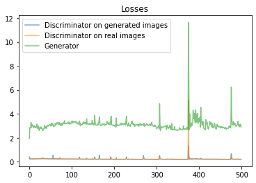

# Fake Pokémon Image Generation

## About
This project goal is to make images of newly generated Pokémon. The perfect tool for this is GAN (Generative Adversarial Network). Main idea of GAN - two competing networks: generator and discriminator. 
Existing Pokémon images are taken from [kaggle dataset][dataset].


## Generator Model.
Model takes a 128-length vector, and uses 4 deconvolution layers followed by leaky ReLU as activation function and batch normalization layers and final deconvolution layer with tanh activation function to map result into [-1;1].

```
def build_generator():
    model = tf.keras.Sequential(name="generator")
    model.add(Dense(4*4*512, use_bias=False, input_shape=(128,)))
    model.add(BatchNormalization())
    model.add(LeakyReLU())

    model.add(Reshape((4, 4, 512)))
    assert model.output_shape == (None, 4, 4, 512) 

    model.add(Conv2DTranspose(512, (5, 5), kernel_initializer=w_init, strides=(1, 1), padding='same', use_bias=False))
    assert model.output_shape == (None, 4, 4, 512)
    model.add(BatchNormalization())
    model.add(LeakyReLU())

    model.add(Conv2DTranspose(256, (5, 5), kernel_initializer=w_init, strides=(2, 2), padding='same', use_bias=False))
    assert model.output_shape == (None, 8, 8, 256)
    model.add(BatchNormalization())
    model.add(LeakyReLU())

    model.add(Conv2DTranspose(128, (5, 5), kernel_initializer=w_init, strides=(2, 2), padding='same', use_bias=False))
    assert model.output_shape == (None, 16, 16, 128)
    model.add(BatchNormalization())
    model.add(LeakyReLU())

    
    model.add(Conv2DTranspose(64, (5, 5), kernel_initializer=w_init, strides=(2, 2), padding='same', use_bias=False))
    assert model.output_shape == (None, 32, 32, 64)
    model.add(BatchNormalization())
    model.add(LeakyReLU())

    model.add(Conv2DTranspose(3, (5, 5), kernel_initializer=w_init, strides=(2, 2), padding='same', use_bias=False, activation='tanh'))
    assert model.output_shape == (None, 64, 64, 3)

    return model
```

## Discriminator model.
Input is 64x64 RGB image. Model consists of 4 blocks. Each block consists of convolution layer, ReLU activation function and a dropout layer. Result of the model has 1 output which closer to 0 if image classified as fake and 1 otherwise
```
def build_discriminator():
    model = tf.keras.Sequential(name="discriminator")

    model.add(Conv2D(64, (5, 5), kernel_initializer=w_init, strides=(2, 2), padding='same', input_shape=[64, 64, 3]))
    model.add(LeakyReLU())
    model.add(Dropout(0.3))

    model.add(Conv2D(128, (5, 5), kernel_initializer=w_init, strides=(2, 2), padding='same'))
    model.add(LeakyReLU())
    model.add(Dropout(0.3))

    model.add(Conv2D(128, (5, 5), kernel_initializer=w_init, strides=(2, 2), padding='same'))
    model.add(LeakyReLU())
    model.add(Dropout(0.3))

    model.add(Conv2D(256, (5, 5), kernel_initializer=w_init, strides=(2, 2), padding='same'))
    model.add(LeakyReLU())
    model.add(Dropout(0.3))

    model.add(Flatten())
    model.add(Dense(1))

    return model
```

## Training GAN

During discriminator training, we ignore the generator loss and just use the discriminator loss, which penalizes the discriminator for misclassifying real faces as fake or generated faces as real. The discriminator’s weights are updated through backpropagation. Generator’s weights are not updated.

During generator training, we use the generator loss, which penalizes the generator for failing to fool the discriminator and generating a face that the discriminator classifies as fake. The discriminator is frozen during generator training and only generator’s weights are updated through backpropagation.


```
def train_step(self, data):
        real_images = data
        batch_size = tf.shape(real_images)[0]
        for _ in range(self.d_rounds):
            ## Train the discriminator
            random_latent_vectors = tf.random.normal(shape=(batch_size, self.latent_dim))
            generated_images = self.generator(random_latent_vectors)
            generated_labels = tf.zeros((batch_size, 1))

            with tf.GradientTape() as ftape:
                predictions = self.discriminator(generated_images)
                predictions = tf.cast(predictions, tf.float32)
                d1_loss = tf.reduce_sum(self.loss_fn(generated_labels, predictions)) * tf.cast((1 / batch_size),tf.float32)

            grads = ftape.gradient(d1_loss, self.discriminator.trainable_weights)
            self.d_optimizer.apply_gradients(zip(grads, self.discriminator.trainable_weights))

            ## Train the discriminator
            labels = tf.ones((batch_size, 1))

            with tf.GradientTape() as rtape:
                predictions = self.discriminator(real_images)
                predictions = tf.cast(predictions, tf.float32)
                #d2_loss = self.loss_fn(labels, predictions)
                d2_loss = tf.reduce_sum(self.loss_fn(labels, predictions)) * tf.cast((1 / batch_size),tf.float32)


            grads = rtape.gradient(d2_loss, self.discriminator.trainable_weights)
            self.d_optimizer.apply_gradients(zip(grads, self.discriminator.trainable_weights))
        for _ in range(self.g_rounds):
            ## Train the generator
            random_latent_vectors = tf.random.normal(shape=(batch_size, self.latent_dim))
            misleading_labels = tf.ones((batch_size, 1))

            with tf.GradientTape() as gtape:
                predictions = self.discriminator(self.generator(random_latent_vectors))
                predictions = tf.cast(predictions, tf.float32)
                g_loss = self.loss_fn(misleading_labels, predictions)
                g_loss = tf.reduce_sum(self.loss_fn(misleading_labels, predictions)) * tf.cast((1 / batch_size),tf.float32)

            grads = gtape.gradient(g_loss, self.generator.trainable_weights)
            self.g_optimizer.apply_gradients(zip(grads, self.generator.trainable_weights))

        self.gan_losses = [d1_loss, d2_loss, g_loss]
        return {"d1_loss": d1_loss, "d2_loss": d2_loss, "g_loss": g_loss} 
```
## Training
Result of the training of 350 epochs is showed bellow.


Around the 300th epoch generator begins to generate almost identical images what indicates that input noice has almost no effect on the final images and there is no meaning to continue learning.

Losses of the models:



[dataset]: <https://www.kaggle.com/kvpratama/pokemon-images-dataset>